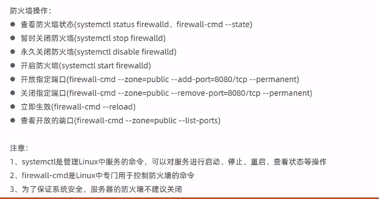
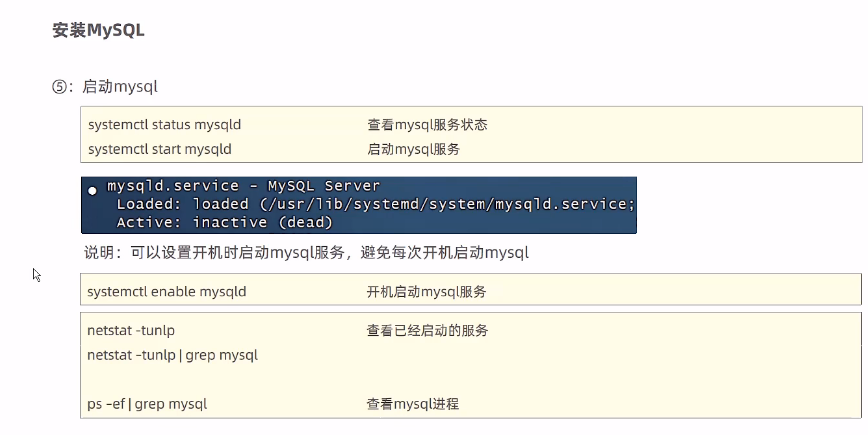
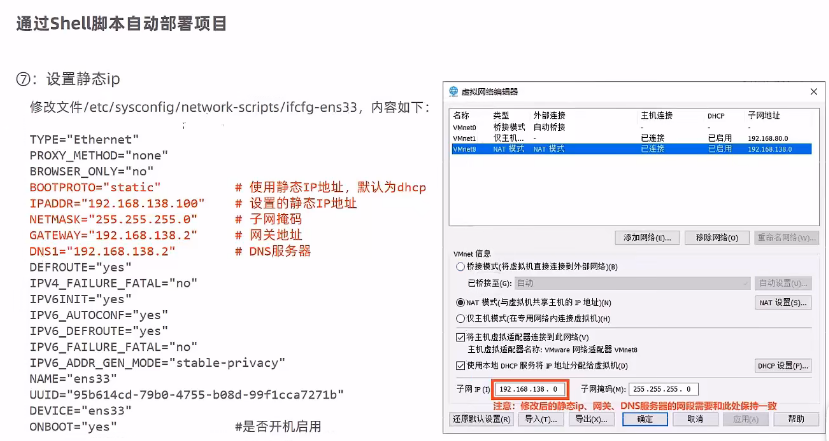

# 三种网络连接方式

桥接模式

- 虚拟系统可以和外部通讯，但是容易造成IP冲突


NAT模式，网络地址转换模式

- 虚拟系统可以和外部系统通讯，不会造成IP冲突


主机模式

- 独立的系统，不和外界产生联系

# 克隆：

- vmware克隆
- 直接复制文件

# 虚拟机快照

用于回到某一个状态

虚拟机迁移和删除

直接拷贝或者剪切虚拟系统文件夹

# 目录结构(一切皆文件)

只有一个根目录 `/`

/bin 存放经常使用的命令

/sbin 存放系统管理员使用的系统管理程序

/home 存放普通用户的主目录

/root 系统管理员用户主目录

/lib 系统开机所需要的最基本的动态连接共享库

# xshell远程登录

# xftp远程传输

# xshell使用vim

`vim Hello.java` Enter

`i` 编辑模式，`ESC`->一般模式，:或者/->命令行模式 `:wq`(保存退出) `:q` `(保存退出)`  :q!`(强制退出，不保存)

一般模式下

`yy` 复制当前行 `p`粘贴 `5yy`复制5行

`dd` 删除当前行

命令行模式下 `/关键字`回车查找，输入n就是查找下一个

# 用户操作

`si - 用户名` 切换用户

`useradd 用户名` 添加用户

`userdel 用户名` 删除用户，保留家目录 ，`userdel -r 用户名`删除并删除用户目录

`passwd 用户名` 指定或修改用户的密码

`id 用户名 `查找用户信息

`who am i` 查看登录的用户的信息

`whoami` 查看当前操作的用户信息

# 组

用于权限统一管理

`groupadd 组名`添加组

`useradd -g 组名 用户名`添加用户并指定组别

`usermod -g 组名 用户名`给指定用户指定组

如果直接`useradd 用户名`该用户就会被加到与用户名同名的组中

用户和组相关的文件

/etc/passwd 记录用户的各种信息

登录Shell为bash

Linux有好几种解释器shell：bash,tcsh,csh等等

/etc/shadow 口令的配置信息

/etc/group 记录Linux包含的组的信息

# centos7找回root密码

开机界面按e进入编辑界面

找到以Linux16开头内容所在的行数，在行的最后面输入:`init=/bin/sh`，再按CTRAL+X进入单用户模式

在光标闪烁的位置中输入：`mount -o remount,rw /`再按回车

输入`passwd`再按回车，输入密码回车，再输入确认密码即可

回车后，接着在新一行输入：`touch /.autorelable`(touch与/后面有一个空格)，按回车

输入`excc /sbin/init`(excc与/后有一个空格),完成后按回车，等待系统自动修改密码，完成后系统会自动重启，新的密码生效

# 修改普通用户密码

终端：`passwd root`

# 帮助指令

man+指令

`man ls`查看ls命令的帮助信息

- Linux中，隐含文件是以'.'开头的

# 文件目录指令

## 显示目录

`pwd` 显示当前目录的绝对路径

## 切换(cd)

`cd`   切换到指定目录  `cd ~` `回到当前用户的家目录    `cd ..`回到当前目录的上一级目录

## 创建删除文件或目录

`rm` `-r`递归删除整个文件夹  `-f` 强制删除不提示

`midir 要创建的目录` `mkdir -p 目录`创建多级目录

`rmdir 目录`删除空目录 `rm -rf 目录`(递归删除)删除非空目录

`rm 文件名` 删除文件 `rm -f 文件名` 强制删除

## 创建文件

`touch 文件名称`创建空文件

## 拷贝

`cp 目标文件 指定目录`复制文件到指定目录

`cp -r /home/bbb/ /opt/`(递归拷贝)把bbb目录拷贝到opt目录下

重复拷贝，强制覆盖:`\cp` `\cp -r /home/bbb/ /opt/`

## 移动文件或目录或重命名

`mv 文件原名 文件新名`重命名

`mv 原文件目录 新文件目录`移动

## 查看文件内容

`cat 文件名` 

`cat -n 文件名`显示内容时显示行号

管道命令：把前面得到的结果交给下一个指令进行处理` |more`

## more

空格键，向下翻一页

回车，向下一行

q，立刻离开more，不在显示该文件内容

Ctrl+F，向下滚动一屏

Ctrl+B，返回上一屏

=，输出当前行的行号

f，输出文件名和当前行的行号

`more 文件目录`查看文件内容

## less

用于分屏查看文件内容，功能与more类型，但比more更强大，支持各种显示终端，less指令在显示文件内容时，并不是一次将整个文件加载之后才显示，而是根据显示需要加载内容，对于显示大型文件具有较高的效率。

[pagedown]向下翻一页

[pageup]向上翻一页

/字串 向下查找指定字串

?字串 向上查找指定字串

## echo指令

`echo $HOSTNAME`输出主机名
`echo "hello"`  输出hello

`echo "hello" > mydate.txt`重定向指令，把hello覆盖到mydate.txt文件中

## head指令

用于显示文件的开头部分内容，默认情况下显示文件的前10行内容

`head 文件`   `head -n 文件`       `head -n 要看的行数 文件`

tail

与head相反

`tail 文件` `tail -n 文件`	`tail -n 要看的行数 文件`

实时监控，看文件是否有编号 `tail -f 文件`

退出监控Ctrl+C

`>`和`>>`指令

输出重定向和追加

覆盖内容/追加内容

`ls -l > 文件`列表的内容写入到文件中(覆盖写)

`ls -al >> 文件`列表的内容写入到文件中(追加到末尾)

`cat 文件1 > 文件2`将文件1的内容覆盖到文件2

`echo "内容" >> 文件`把内容追加到文件中

## ln指令

给源文件创建一个软链接

`ln -s 原文件或目录 软链接名`

`rm 软链接名`

建立软链接后使用`pwd`仍然是软链接所在目录

## history指令

查看已经执行过历史命令，也可以执行历史命令

`history` `history 10` `!5`

# 时间日期类指令

## date

`date` 显示当前时间

`date "+%Y- %m- %d"` 显示年月日

`date "+%Y- %m- %d %H: %M: %S"`

`date -s 字符串时间`设置系统当前时间

## cal

`cal`查看日历

`cal 2020`查看2020年的日历

## find

`find 搜索范围 【选项】`

【选项】：`-name 文件名` `-user 用户名` `-size 文件大小`

案例：

`find /home -name hello.text`根据名称查找/home目录下的hello.txt文件

`find /opt -user nobody`根据用户nobody查找/opt目录下的文件(可加上` | more`便于查看)

`find / -size +200M`查找整个Linux系统下大于200M的文件(+大于 -小于 n等于,单位：k,M,G)

## locate

可快速定位文件路径，查询速度快。

基于数据库查询，所以第一次运行前，必须使用updatedb指令创建locate数据库

```shell
updatedb
locate 文件名
```

## which

检索查看某个指令在哪个目录下

`which 指令`

## grep指令和管道符号 |

grep过滤查找，管道符"|"，表示将前一个命令的处理结果输出传递给后面的命令处理

`grep 【选项】 查找内容 源文件`

选项：`-n` 显示匹配行及行号  	 `-i`忽略字母大小写

在hello.txt文件中查找"yes"所在行，并且显示行号：

`cat /home/hello.txt | grep -n "yes"`

`grep -n "yes" /home/hello.txt`

# 压缩和解压

## gzip压缩，gunzip解压

`gzip 文件` `gunzip 文件.gz`

## zip压缩，inzip解压

zip选项`-r`递归压缩，即压缩目录

unzip选项`-d<目录>`指定解压后文件的存放目录

`zip -r myhome.zip /home`把home目录及其包含的文件和子文件夹都压缩成myhome.zip

`mkdir /opt/temp` 创建目录 `unzip -d /opt/tmp /home/myhome.zip`把myhome.zip解压到/opt/tmp目录下

## tar

`tar 【选项】 XXX.tar.gz 打包的内容`

既可以压缩，也可以解压

```
-c 产生.tar打包文件 
-v 显示详细信息
-f 指定压缩后的文件名
-z 打包同时压缩
-x 解包.tar文件
```

`tar -zcvf pc.tar.gz /home/pig.txt /home/cat.txt`将/home/pig.txt和/home/cat.txt 压缩成pc.tar.gz

`tar -zchvf myhome.tar.gz /home/`把/home目录压缩成myhime.tar.gz

`tar -zxvf pc.tar.gz`将pc.tar.gz解压到当前目录

`tar -zxvf /home/myhome.tar.gz -C /opt/temp2`把myhome.tar.gz解压到/opt/temp2


# centos自带openjdk问题

centos安装openjdk后无法使用javac、jps等命令 由于centos安装的opendjk缺少devel组件，需要自行安装。 解决方案:

先查找需要安装的openjdk的devel组件

```
# yum search openjdk
```

以安装openjdk8的devel为例

```
# yum install java-1.8.0-openjdk-devel.x86_64
```





# 手动部署项目

```
nohup java -jar reggie_take_out-1.0-SNAPSHOT.jar &>hello.log &
```

后台运行SpringBoot程序，并将日志输出到日志文件

停止进程 `kill -9 进程`

# Shell自动部署项目

设置静态ip

