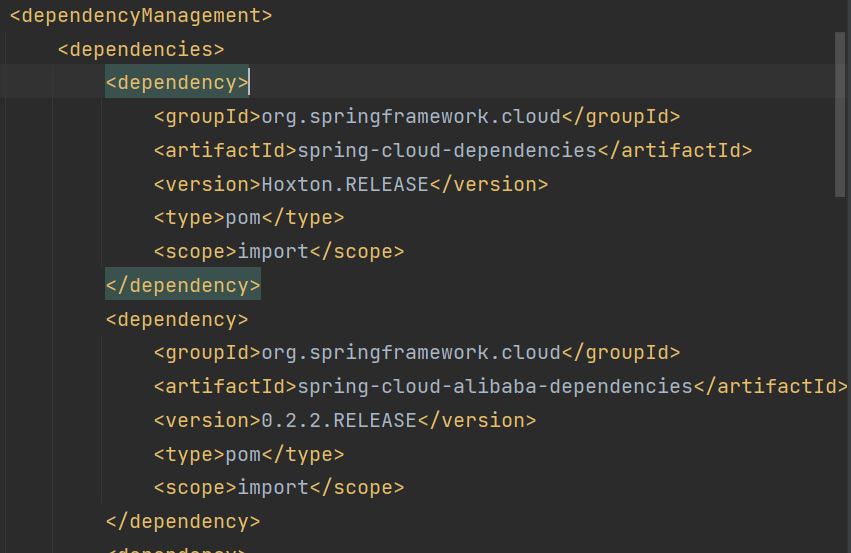
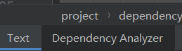
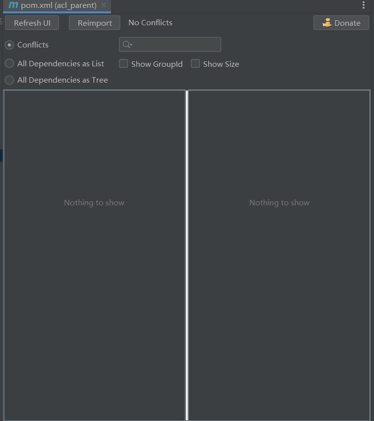
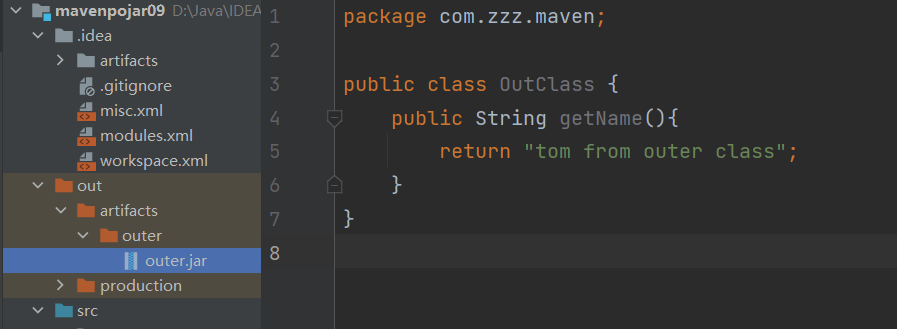
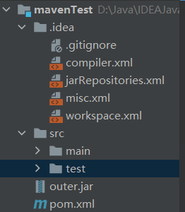
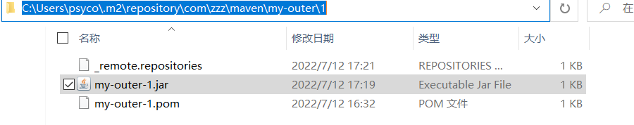

# Maven

父工程：管理项目依赖版本 例如SpringBoot版本

子模块：使用具体依赖，不需要指定版本

## jar和war

jar包直接`java -jar xxx.jar`运行

war包放在tomcat的webapp目录下，再启动tomcat运行

## 基本命令

`mvn compile`主程序编译

`mvn test-compile`测试程序编译

主体程序编译结果存放的目录：target/classes

测试程序编译结果存放的目录：target/test-classes

`mvn test`

测试的报告存放的目录：target/surefire-reports

`mvn clean` 删除target目录

`mvn package` 打包，生成jar或war包

`mvn install` 安装，安装的效果是将本地构建过程中生成的 jar 包存入 Maven 本地仓库。这个 jar 包在 Maven 仓库中的路径是根据它的坐标生成的。另外，安装操作还会将 pom.xml 文件转换为 XXX.pom 文件一起存入本地仓库。所以我们在 Maven 的本地仓库中想看一个 jar 包原始的 pom.xml 文件时，查看对应 XXX.pom 文件即可，它们是名字发生了改变，本质上是同一个文件。

`mvn clean install -Dmaven.test.skip=true`跳过测试打包

## 基本标签

### modules,module

聚合功能的配置

内容为当前工程的子工程名

### dependencyManagement

使用dependencyManagement标签配置对依赖的管理
被管理的依赖并没有真正被引入到工程 

子工程引用父工程中的依赖信息时，可以把版本号去掉。
把版本号去掉就表示子工程中这个依赖的版本由父工程决定。
具体来说是由父工程的dependencyManagement来决定。


### 标签的可选值

标签的位置：dependencies/dependency/scope

标签的可选值：compile/test/provided/system/runtime/import

- Maven 依赖中 scope 的默认值是**compile**

- Scope 指定了依赖（第三方jar包）的 **作用范围**

compile：通常使用的第三方框架的 jar 包这样在项目实际运行时真正要用到的 jar 包都是以 compile 范围进行依赖的。比如 SSM 框架所需jar包。

test：测试过程中使用的 jar 包，以 test 范围依赖进来。比如 junit。

provided：在开发过程中需要用到的“服务器上的 jar 包”通常以 provided 范围依赖进来。比如 servlet-api、jsp-api。而这个范围的 jar 包之所以不参与部署、不放进 war 包，就是避免和服务器上已有的同类 jar 包产生冲突，同时减轻服务器的负担。

system：在编译、测试时有效，但是在运行时无效。

import：导入依赖范围。该范围的依赖只在dependencyManagement标签才有效。它的作用是将目标pom的dependencyManagement标签中的依赖，合并到当前pom的dependencyManagement标签内，供引用项目中使用。由于import依赖的特殊性，一般看到import范围时，就会存在`<type>pom</type>`，即指向打包类型为pom的模块。

## 项目部署

打包运行/Docker部署

### 单一架构项目部署

#### 直接部署方式

- maven打包，上传jar包到服务器，运行

- 利用git和shell脚本自动部署

更改配置连接信息，例如账号、密码、ip地址

跳过测试打包`mvn clean package -Dmaven.test.skip=true`

设定工程构建过程中使用的最终名称

```xml
<build>
	<finalName>demo1</finalName>
</build>
```

上传war/jar包到tomcat的webapp目录下，启动tomcat

springboot和ssm项目直接 `java -jar xxxxx.jar`

#### Docker部署


### 微服务项目部署

#### 修改MySQL连接信息

#### 打包

(顺序：父工程->被依赖的模块->当前模块)，跳过测试打包`mvn clean package -Dmaven.test.skip=true`

#### 生成微服务可运行jar包

应用微服务打包插件

jar包包括当前微服务本身代码，当前 微服务所依赖的jar包，内置Tomcat(Servlet容器)，与jar包可以通过java -jar方式直接启动相关的配置

要加入额外的资源、相关配置等等，仅靠Maven自身的构建能力是不够的，因此要通过build引入插件。

build：配置对构建过程的定制

```xml
<build>
	<plugins>
    	<plugin>
        	<groupIf>org.springframework.boot</groupIf>
        	<artifactId>spring-boot-maven-plugin</artifactId>
        </plugin>
    </plugins>
</build>
```

spring-boot:repackage要求必须将当前微服务本身的jar包准备好，所以必须在它之前执行package子命令

spring-boot:repackage子命令：调用spring-boot插件的repackage目标

`mvn clean package spring-boot:repackage -Dmaven.test.skip=true`

(对每个微服务都执行)

#### 执行部署

启动nacos

`sh /xx/xx/nacos/bin/startup.sh -m standalone`

上传jar包

启动微服务

```
nohup java -jar xxxxx.jar>xxx.log 2>&1 &
nohup java -jar xxxxx.jar>xxx.log 2>&1 &
```

## jar包冲突

ClassNotFound：编译过程找不到类

NoClassDefFoundError：运行过程中找不到类

LinkageError：不同类加载器分别加载的多个类有相同的全限定名

NoSuchMethodError

导致原因：同一jar有不同版本，不同jar包中包含同名类

### 解决

找到冲突jar包，exclusions排除

#### IDEA 的 Maven Helper 插件

这个插件是 IDEA 中安装的插件，不是 Maven 插件。它能够给我们罗列出来同一个 jar 包的不同版本，以及它们的来源。但是对不同 jar 包中同名的类没有办法。





#### Maven 的 enforcer 插件

使用 Maven 的 enforcer 插件既可以检测同一个 jar 包的不同版本，又可以检测不同 jar 包中同名的类。

`mvn clean package enforcer:enforce`

## 导入Maven体系外jar包

不是用Maven的方式发布的jar包无法通过Maven导入

例如人脸识别jar包，海康视频监控jar包

例如：自己导出一个jar包，导入到maven项目中





将该jar包安装到Maven仓库

```sh
mvn install:install-file -Dfile=[体系外 jar 包路径] \
-DgroupId=[给体系外 jar 包强行设定坐标] \
-DartifactId=[给体系外 jar 包强行设定坐标] \
-Dversion=1 \
-Dpackaging=jar
```

