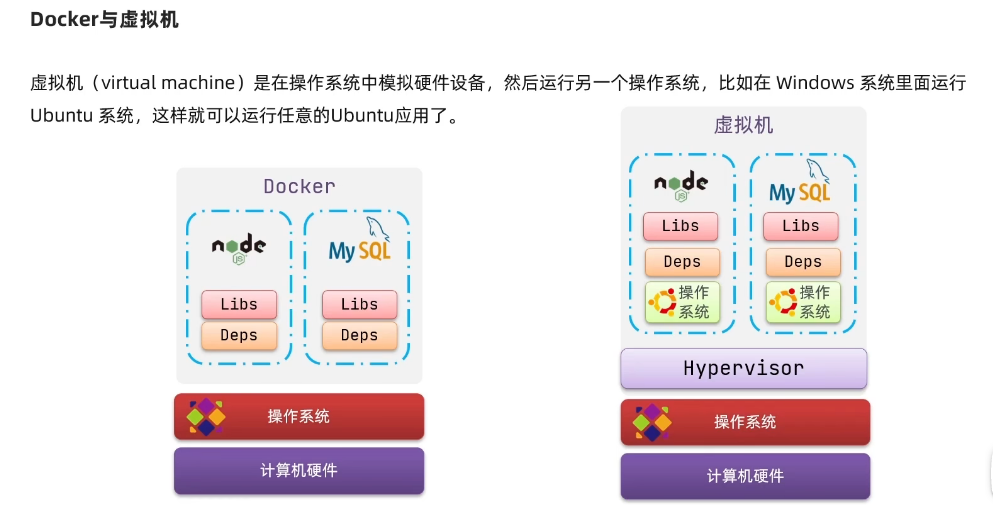

# SpringCloud

## Eureka

RestTemplate远程调用


Ribbon

负载均衡

`http://userservice/user/1`根据服务名称后从`eureka-server`中拉取服务ip端口`localhost:8081`开始轮询

@LoadBalanced标记RestTemplate发起的请求要被Ribbon(类LoadBalancerInterceptor)拦截处理

LoadBalancerInterceptor 实现 ClientHttpRequestInterceptor接口 拦截由客户端发起的请求

拦截后根据request的uri和host(服务昵称userservice)，把服务昵称给RibbonLoadBalanceClient执行，再通过`getLoadBalancer(serviceId)`得到动态服务列表均衡器(得到服务列表)

->`getServer(loadBalancer,hint)`->chooseServer->super.chooseServer根据IRuler接口的实现类(默认为ZoneAvoidanceRule)规定的规则(轮询？随机？)获得端口号，再用真实的ip和port来代替userservice(服务昵称)发起请求


## Nacos

为什么要集群：防止出现跨集群调用

服务调用尽可能选择本地集群的服务，跨集群调用延迟较高

```yml
userservice:
  ribbon:
    NFLoadBalancerRuleClassName: com.alibaba.cloud.nacos.ribbon.NacosRule # 优先随机访问本集群，如果本地集群没有会访问其他集群
```

可设置IP访问权重，权重大的被访问频率高，权重为0表示不访问这个IP

### 环境隔离

Namespace-》 Group-》 Service/Data

Nacos中服务存储和数据存储的最外层都是一个名为namespace的东西，用来做最外层隔离

用于环境变化隔离，开发环境，生产环境

- namespace用于环境隔离
- 每个namespace都有唯一id
- 不同namespace下的服务不可见

临时实例采用心跳检测，每隔一段时间发送到Nacos验证服务是否正常，不正常剔除(和Eureka一样)

非临时实例 nacos主动询问，如果不正常会标红，不剔除

nacos注册中心比eureka多了消息推送，如果服务有变动(例如挂了一个服务)会立即推送给服务消费者


### 统一配置管理

#### Nacos配置管理

#### 微服务配置拉取

#### 配置热更新

#### 多环境配置共享

不同环境的相同配置属性放到userservice.yaml中

优先级：

服务名-profile.yaml > 服务名称.yaml > 本地配置

nacos中的配置大于本地配置

### Nacos集群搭建


## Feign

RestTemplate方式调用存在问题

代码可读性差，编程体验不统一

参数复杂的url难以维护

### 远程调用

Feign 声明式的http客户端 ，帮助我们优雅的实现http请求的发送，解决上面提到的问题

- 引入依赖
- 添加@EnableFeignClient注解
- 编写FeignClient接口
- 使用FeignClient中定义的方法代替RestTemplate

### 自定义Feign配置


### Feign的性能优化


### Feign的最佳实践


但是一般不推荐在客户端和服务端之间共享接口，会造成紧耦合(API层面耦合),对mvc不起作用，方法参数无法继承下来


但是会造成引入多余的方法client方法


## Gateway

### 基本使用


### 路由断言


### 路由过滤器


#### 全局过滤器GlobalFilter

和defaultFilters作用一样


### 过滤器执行顺序


## Docker





```console
 docker run \
  --name some-mysql \
  -e MYSQL_ROOT_PASSWORD=123 \
  -p 3306:3306 \
  -v /tmp/mysql/conf/hmy.cnf:/etc/mysql/conf.d/hmy.cn \
  -v /tmp/mysql/data:/var/lib/mysql \
  -d  \
  mysql:5.7.25
```


### 自定义镜像


## MQ


## ES


### RestClient操作索引库，文档 


### match查询


```D
GET /hotel/_search
{
  "query":{	
    "geo_distance":{
      "distance":"15km",
      "location":"31.21,121.5"
    }
  }
}
```

### 相关性算分


```D
GET /hotel/_search
{
  "query": {
    "function_score": {
      "query":{
        "match": {
        "name": "外滩"
      }},
      "functions": [
        {
          "filter": {
            "term": {
              "brand": "如家"
            }
          },
          "weight": 10
          
        }
      ],
      "boost_mode": "multiply"
    }
  }
}
```

### 复合查询


### 搜索结果处理

#### 排序


#### 分页


#### 高亮


默认清空下ES搜索字段必须与高亮字段一致，否则不会高亮

`"require_field_match": "false"`

```json
GET /hotel/_search
{
  "query": {
    "match": {
      "all": "如家"
    }
  },
  "highlight": {
    "fields": {
      "name": {
        "require_field_match": "false"
      }
    }
  }
}
```


### RestClient查询文档

#### 查询


**要构建查询条件，关键在于：QueryBuilders**

#### 排序分页


#### 高亮


#### 距离排序


#### 组合查询


### 聚合


```json
GET /hotel/_search
{
  "size": 0,
  "aggs": {
    " brandAgg": {
      "terms": {
        "field": "brand",
        "size": 10,
        "order": {
          "_count": "asc"
        }
      }
    }
  }
}

GET /hotel/_search
{
  "query": {
    "range": {
      "price": {
        "lte": 200
      }
    }
  }, 
  "size": 0,
  "aggs": {
    " brandAgg": {
      "terms": {
        "field": "brand",
        "size": 10,
        "order": {
          "_count": "asc"
        }
      }
    }
  }
}

GET /hotel/_search
{
  "size": 0,
  "aggs": {
    " brandAgg": {
      "terms": {
        "field": "brand",
        "size": 20,
        "order": {
          "scoreAgg.avg": "desc"
        }
      },
      "aggs": {
        "scoreAgg": {
          "stats": {
            "field": "score"
          }
        }
      }
    }
  }
}
```


上传拼音分词器


```json
PUT /test
{
  "settings": {
    "analysis": {
      "analyzer": { 
        "my_analyzer": { 
          "tokenizer": "ik_max_word",
          "filter": "py"
        }
      },
      "filter": {
        "py": { 
          "type": "pinyin",
          "keep_full_pinyin": false,
          "keep_joined_full_pinyin": true,
          "keep_original": true,
          "limit_first_letter_length": 16,
          "remove_duplicated_term": true,
          "none_chinese_pinyin_tokenize": false
        }
      }
    }
  }
}
```


```json
PUT /hotel
{
  "settings": {
    "analysis": {
      "analyzer": {
        "text_anlyzer": {
          "tokenizer": "ik_max_word",
          "filter": "py"
        },
        "completion_analyzer": {
          "tokenizer": "keyword",
          "filter": "py"
        }
      },
      "filter": {
        "py": {
          "type": "pinyin",
          "keep_full_pinyin": false,
          "keep_joined_full_pinyin": true,
          "keep_original": true,
          "limit_first_letter_length": 16,
          "remove_duplicated_term": true,
          "none_chinese_pinyin_tokenize": false
        }
      }
    }
  },
  "mappings": {
    "properties": {
      "id":{
        "type": "keyword"
      },
      "name":{
        "type": "text",
        "analyzer": "text_anlyzer",
        "search_analyzer": "ik_smart",
        "copy_to": "all"
      },
      "address":{
        "type": "keyword",
        "index": false
      },
      "price":{
        "type": "integer"
      },
      "score":{
        "type": "integer"
      },
      "brand":{
        "type": "keyword",
        "copy_to": "all"
      },
      "city":{
        "type": "keyword"
      },
      "starName":{
        "type": "keyword"
      },
      "business":{
        "type": "keyword",
        "copy_to": "all"
      },
      "location":{
        "type": "geo_point"
      },
      "pic":{
        "type": "keyword",
        "index": false
      },
      "all":{
        "type": "text",
        "analyzer": "text_anlyzer",
        "search_analyzer": "ik_smart"
      },
      "suggestion":{
          "type": "completion",
          "analyzer": "completion_analyzer"
      }
    }
  }
}
```


### 数据同步


有业务耦合，性能下降，hotel-demo会影响hotel-admin的操作


依赖mq的可靠性


canal监听mysql的binlog，无耦合


#### MQ实现mysql与elasticsearch数据同步


### ES集群


docker部署es集群

cerebro管理集群


