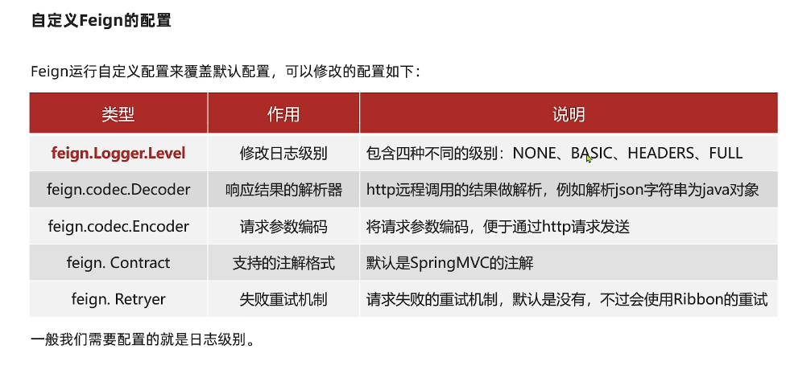

# SpringCloud

## Eureka

RestTemplate远程调用


Ribbon

负载均衡

`http://userservice/user/1`根据服务名称后从`eureka-server`中拉取服务ip端口`localhost:8081`开始轮询

@LoadBalanced标记RestTemplate发起的请求要被Ribbon(类LoadBalancerInterceptor)拦截处理

LoadBalancerInterceptor 实现 ClientHttpRequestInterceptor接口 拦截由客户端发起的请求

拦截后根据request的uri和host(服务昵称userservice)，把服务昵称给RibbonLoadBalanceClient执行，再通过`getLoadBalancer(serviceId)`得到动态服务列表均衡器(得到服务列表)

->`getServer(loadBalancer,hint)`->chooseServer->super.chooseServer根据IRuler接口的实现类(默认为ZoneAvoidanceRule)规定的规则(轮询？随机？)获得端口号，再用真实的ip和port来代替userservice(服务昵称)发起请求


## Nacos

为什么要集群：防止出现跨集群调用

服务调用尽可能选择本地集群的服务，跨集群调用延迟较高

```yml
userservice:
  ribbon:
    NFLoadBalancerRuleClassName: com.alibaba.cloud.nacos.ribbon.NacosRule # 优先随机访问本集群，如果本地集群没有会访问其他集群
```

可设置IP访问权重，权重大的被访问频率高，权重为0表示不访问这个IP

### 环境隔离

Namespace-》 Group-》 Service/Data

Nacos中服务存储和数据存储的最外层都是一个名为namespace的东西，用来做最外层隔离

用于环境变化隔离，开发环境，生产环境

- namespace用于环境隔离
- 每个namespace都有唯一id
- 不同namespace下的服务不可见

临时实例采用心跳检测，每隔一段时间发送到Nacos验证服务是否正常，不正常剔除(和Eureka一样)

非临时实例 nacos主动询问，如果不正常会标红，不剔除

nacos注册中心比eureka多了消息推送，如果服务有变动(例如挂了一个服务)会立即推送给服务消费者


### 统一配置管理

#### Nacos配置管理

#### 微服务配置拉取

#### 配置热更新

#### 多环境配置共享

不同环境的相同配置属性放到userservice.yaml中

优先级：

服务名-profile.yaml > 服务名称.yaml > 本地配置

nacos中的配置大于本地配置

### Nacos集群搭建


## Feign

RestTemplate方式调用存在问题

代码可读性差，编程体验不统一

参数复杂的url难以维护

### 远程调用

Feign 声明式的http客户端 ，帮助我们优雅的实现http请求的发送，解决上面提到的问题

- 引入依赖
- 添加@EnableFeignClient注解
- 编写FeignClient接口
- 使用FeignClient中定义的方法代替RestTemplate

### 自定义Feign配置




### Feign的性能优化


### Feign的最佳实践


但是一般不推荐在客户端和服务端之间共享接口，会造成紧耦合(API层面耦合),对mvc不起作用，方法参数无法继承下来


但是会造成引入多余的方法client方法


## Gateway

### 基本使用


### 路由断言


### 路由过滤器


#### 全局过滤器GlobalFilter

和defaultFilters作用一样


### 过滤器执行顺序


## Docker


