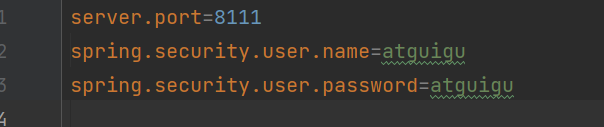
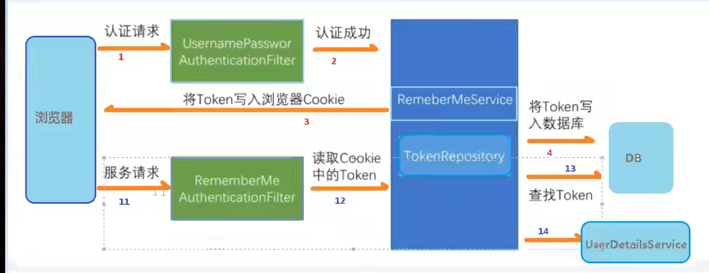
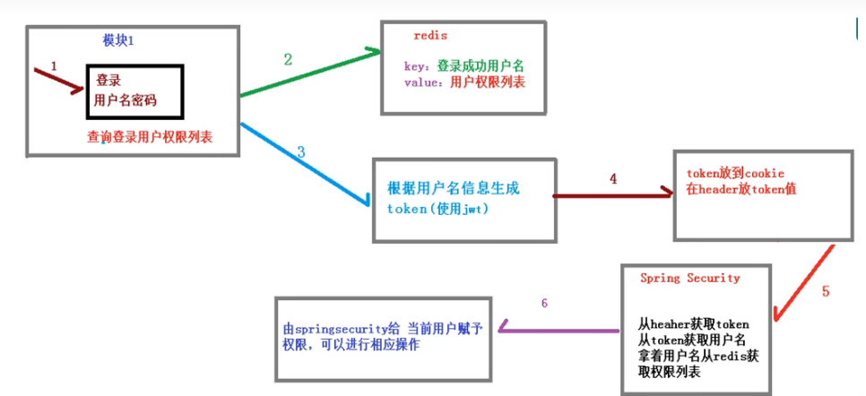
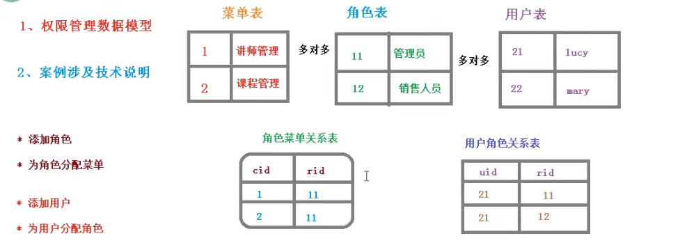
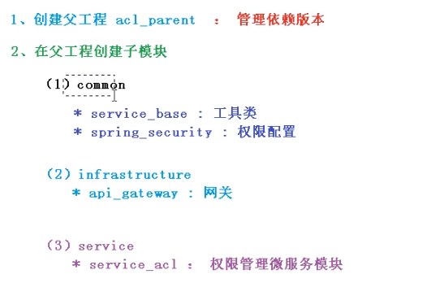
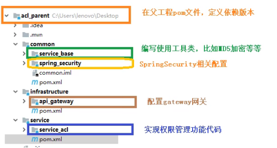

# SpringSecurity web

安全管理框架

需要依赖多


shiro 轻量

- SSM+Shiro
- SpringBoot/SpringCloud+SpringSecurity

## 配置用户名密码

- 配置文件



- `extends WebSecurityConfigurerAdapter`

```java
@Configuration
public class SecurityConfig extends WebSecurityConfigurerAdapter {

    @Override
    protected void configure(AuthenticationManagerBuilder auth) throws Exception {
        BCryptPasswordEncoder passwordEncoder = new BCryptPasswordEncoder();
        String password = passwordEncoder.encode("123");
        auth.inMemoryAuthentication().withUser("lucy").password(password).roles("admin");
    }

    @Bean
    PasswordEncoder password() {
        return new BCryptPasswordEncoder();
    }

}
```

- 自定义实现类配置

1. 创建配置类，设置使用哪个userDetailsService实现类
2. 编写实现类，返回User对象，User对象有用户名密码和操作权限
2. 自定义登录页面

```java
@Configuration
public class SecurityConfig1 extends WebSecurityConfigurerAdapter {

    @Autowired
    private UserDetailsService userDetailsService;

    @Override
    protected void configure(AuthenticationManagerBuilder auth) throws Exception {
        auth.userDetailsService(userDetailsService).passwordEncoder(password());
    }

    @Override
    protected void configure(HttpSecurity http) throws Exception {
        http.formLogin()//自定义登录页面
                .loginPage("/login.html") //登录页面
                .loginProcessingUrl("/user/login") //登录访问路径
                .defaultSuccessUrl("/test/index").permitAll() //登录成功跳转
                .and().authorizeRequests()
                .antMatchers("/","/test/add","/user/login").permitAll()
                .anyRequest().authenticated()
                .and().csrf().disable();//关闭csrf防护
    }

    @Bean
    PasswordEncoder password() {
        return new BCryptPasswordEncoder();
    }

}
```

```java
@Service("userDetailsService")
public class MyUserDetailsService implements UserDetailsService {

    @Autowired
    private UsersMapper usersMapper;

    @Override
    public UserDetails loadUserByUsername(String username) throws UsernameNotFoundException {
        QueryWrapper<Users> queryWrapper = new QueryWrapper<>();
        queryWrapper.eq("username",username);
        Users users = usersMapper.selectOne(queryWrapper);
        if(users == null ){
            throw new UsernameNotFoundException("用户名不存在");
        }

        //查数据库
        List<GrantedAuthority> auths = AuthorityUtils.commaSeparatedStringToAuthorityList("role");

        //

        return new User(users.getUsername(),new BCryptPasswordEncoder().encode(users.getPassword()),auths);
    }
}
```

## 设置访问权限

`.antMatchers("/test/index").hasAuthority("admins")//只有admin权限才能访问`

`.antMatchers("/test/index").hasAnyAuthority("admins,manager")//有其中一个权限即可访问`

`.antMatchers("/test/index").hasRole("sale")//为ROLE_sale`

`.antMatchers("/test/index").hasAnyRole("sale,customer")//多个角色的任何一个就可访问`

```java
//配置没有权限访问跳转自定义页面
        http.exceptionHandling().accessDeniedPage("/unauth.html");
```


```java
    @Override
    protected void configure(HttpSecurity http) throws Exception {
        //配置没有权限访问跳转自定义页面
        http.exceptionHandling().accessDeniedPage("/unauth.html");

        http.formLogin()//自定义登录页面
                .loginPage("/login.html") //登录页面
                .loginProcessingUrl("/user/login") //登录访问路径
                .defaultSuccessUrl("/test/index").permitAll() //登录成功跳转
                .and().authorizeRequests()
                .antMatchers("/","/test/add","/user/login").permitAll()
                .antMatchers("/test/index").hasAuthority("admins")//只有admin权限才能访问
                .anyRequest().authenticated()
                .and().csrf().disable();//关闭csrf防护
    }
```

## 注解授权

启动类上加注解

`@EnableGlobalMethodSecurity(securedEnabled = true)`

```java
@SpringBootApplication
@EnableGlobalMethodSecurity(securedEnabled = true)
public class Springsecuritydemo1Application {

    public static void main(String[] args) {
        SpringApplication.run(Springsecuritydemo1Application.class, args);
    }

}
```

@Secured

具有某个角色可以用访问该方法

```java
@GetMapping("update")
    @Secured({"ROLE_sale","ROLE_manager"})
    public String update() {
        return "hello update";
    }
```

`@EnableGlobalMethodSecurity(securedEnabled = true,prePostEnabled = true)`

@PreAuthorize

执行方法前校验admins

```java
@GetMapping("update")
    //@Secured({"ROLE_sale","ROLE_manager"})
    @PreAuthorize("hasAnyAuthority('admins')")
    public String update() {
        return "hello update";
    }
```

@PostAuthorize

执行方法后校验

@PreFilter

@PostFilter

## 用户注销

修改配置类`protected void configure(HttpSecurity http) throws Exception`加上

```java
http.logout().logoutUrl("/logout").logoutSuccessUrl("/index/add").permitAll();
```

## 自动登录

1. Cookie
2. 安全框架机制实现自动登录

原理：

1. 认证成功->浏览器cookie存加密字符串，数据库存cookie的加密串，用户信息字符串
2. 再次访问->获取cookie信息，拿着cookie信息到数据库进行比对，如果查询到对应信息，认证成功，就可以登录。



springsecurity实现：

- 创建表

```
CREATE TABLE `persistent_logins`(
	`username` VARCHAR (64) NOT NULL,
	`series` VARCHAR(64) NOT NULL,
	`token` VARCHAR(64) NOT NULL,
	`last_used` TIMESTAMP NOT NULL DEFAULT CURRENT_TIMESTAMP ON UPDATE CURRENT_TIMESTAMP,
	PRIMARY KEY(`series`)
)ENGINE=INNODB DEFAULT CHARSET=utf8;
```

- 配置类注入数据源，配置操作数据库对象

```java
    @Autowired
    private DataSource dataSource;

    @Bean
    public PersistentTokenRepository persistentTokenRepository(){
        JdbcTokenRepositoryImpl jdbcTokenRepository = new JdbcTokenRepositoryImpl();
        jdbcTokenRepository.setDataSource(dataSource);

        //jdbcTokenRepository.setCreateTableOnStartup(true); //设置自动创建token表
        return jdbcTokenRepository;
    }
```

- ```java
  .and().rememberMe().tokenRepository(persistentTokenRepository())
                  .tokenValiditySeconds(60)//设置有效时长
                  .userDetailsService(userDetailsService)//设置userDetailsService操作数据库
  ```

  

```java
    @Override
    protected void configure(HttpSecurity http) throws Exception {

        //配置没有权限访问跳转自定义页面
        http.exceptionHandling().accessDeniedPage("/unauth.html");

        //
        http.logout().logoutUrl("/logout").logoutSuccessUrl("/test/add").permitAll();


        http.formLogin()//自定义登录页面
                .loginPage("/login.html") //登录页面
                .loginProcessingUrl("/user/login") //登录访问路径
                .defaultSuccessUrl("/success.html").permitAll() //登录成功跳转
                .and().authorizeRequests()
                .antMatchers("/","/test/add","/user/login").permitAll()
                // .antMatchers("/test/index").hasAuthority("admins")//只有admin权限才能访问
                // .antMatchers("/test/index").hasAnyAuthority("admins,manager")
                //ROLE_xxx
                .antMatchers("/test/index").hasRole("sale")
                //

                .anyRequest().authenticated()
                .and().rememberMe().tokenRepository(persistentTokenRepository())
                .tokenValiditySeconds(60)//设置有效时长
                .userDetailsService(userDetailsService)//设置userDetailsService操作数据库
                .and().csrf().disable();//关闭csrf防护
    }
```

- 登录页面添加复选框 name必须为"remember-me"

```html
<input type="checkbox" name="remember-me">自动登录
```

## CSRF

跨站请求伪造

跨站请求攻击，简单地说，是攻击者通过一些技术手段七篇用户的浏览器去访问一个自己曾经认证过的网站并运行一些操作(如发邮件，发消息，甚至财产操作如转账和购买商品)。由于浏览曾经认证过，所以被访问的网站会认为是真正的用户操作而去运行

->>web中用户身份验证的一个漏洞：简单的身份验证之恶能保证请求发自某个用户的浏览器，却不能保证请求本身是用户自愿发出的。

实现CSRF原理：(只对"GET","HEAD","TRACE","OPTIONS"防护)

生成csrfToken保存到HttpSession，每次访问把带着过来的token和session存储的token是否一样

```java
protected void doFilterInternal(HttpServletRequest request, HttpServletResponse response, FilterChain filterChain) throws ServletException, IOException {
    request.setAttribute(HttpServletResponse.class.getName(), response);
    CsrfToken csrfToken = this.tokenRepository.loadToken(request);//创建token
    boolean missingToken = csrfToken == null;
    if (missingToken) {
        csrfToken = this.tokenRepository.generateToken(request);
        this.tokenRepository.saveToken(csrfToken, request, response);
    }

    request.setAttribute(CsrfToken.class.getName(), csrfToken);
    request.setAttribute(csrfToken.getParameterName(), csrfToken);//得到表单传递过来的token
    //requireCsrfProtectionMatcher指定了防护的请求方式
    if (!this.requireCsrfProtectionMatcher.matches(request)) {
        filterChain.doFilter(request, response);
    } else {
        String actualToken = request.getHeader(csrfToken.getHeaderName());
        if (actualToken == null) {
            actualToken = request.getParameter(csrfToken.getParameterName());
        }

        if (!csrfToken.getToken().equals(actualToken)) {
            if (this.logger.isDebugEnabled()) {
                this.logger.debug("Invalid CSRF token found for " + UrlUtils.buildFullRequestUrl(request));
            }

            if (missingToken) {
                this.accessDeniedHandler.handle(request, response, new MissingCsrfTokenException(actualToken));
            } else {
                this.accessDeniedHandler.handle(request, response, new InvalidCsrfTokenException(csrfToken, actualToken));
            }

        } else {
            filterChain.doFilter(request, response);
        }
    }
}
```

# Spring Security微服务权限

## 基本概念

单点登录：一次登录其他模块能直接操作

- 基于Session，那么Spring Security会对cookie里的sessionId进行解析，找到服务器存储的session信息，然后判断单曲用户是否符合请求的要求
- 如果是token，则是解析出token，然后将当前请求加入到SpringSecurity管理的权限信息中去



查出权限列表，存入到redis中，根据用户名生成token再放入到cookie中，在header放token，springsecurity从header获取token，从token获取用户名，根据用户名从redis获取权限列表。由springsecurity给当前与用户赋予权限，可以进行相应操作。

## 案例



### 创建工程





### 登录


### 添加角色

### 为角色分配菜单

### 添加用户分配角色
